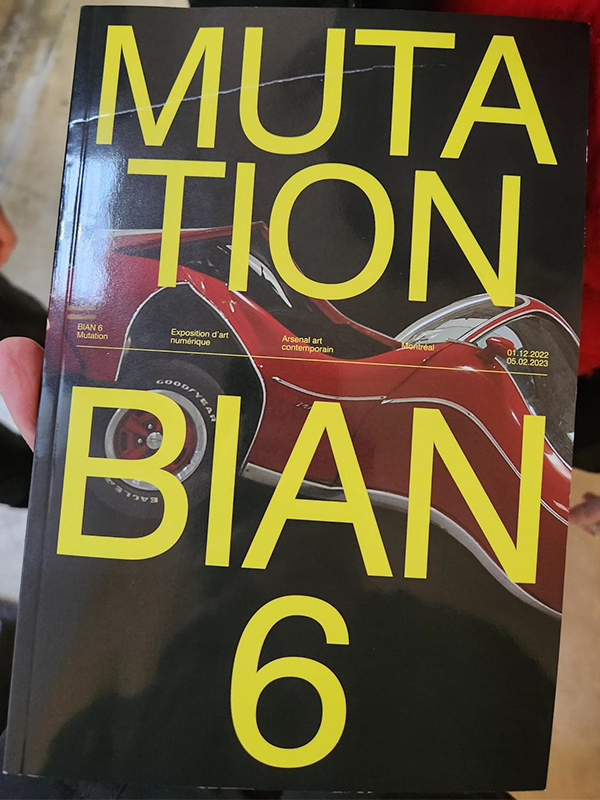
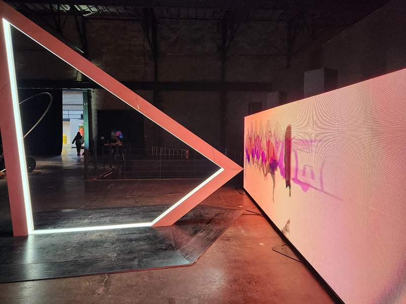
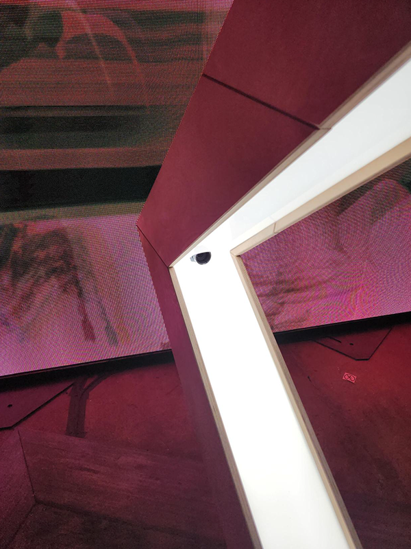

# BIAN 6 - METAMORPHOSIS - MUTATION
###### Arsenal art contemporain Montréal, exposition temporaire interieure, visité le 2 fevrier 2023
## RÉSONANCES
###### Louis-Philippe Rondeau, 2022

RÉSONANCES est une métaphore sur le temps qui défile. Toutefois, au lieu d’exprimer la linéarité du temps, cette installation <b>interactive</b> évoque la manière dont les gestes du présent se superposent à ceux du passé. Tel un écho visuel et sonore, RÉSONANCES représente nos actions antérieures qui resurgissent, amplifiant le présent, et devenant à leur tour passé, telle une perpétuelle mise en abyme temporelle. Cette boucle visuelle et sonore permet à l’interacteur de chorégraphier son présent en le construisant sur son propre passé, de manière ludique et singulière. (Description de l'oeuvre tiré du site elektramontreal)

### Fonctionnement de l'oeuvre

RÉSONANCES a été donné un grand espace d'environ 6 mètres de large, l'œuvre se situe proche de l'entrée de l'exposition, sur le mur gauche (vu de l'entrée). Plusieurs composantes électroniques sont utilisées pour capter des images de nous, principalement un capteur intégré dans un support d'acier et de bois. Ces images sont ensuite projetées sur un écran, chaque fois qu'une image passe sur l'écran elle commence a ralentir et devenir plus deformé jusqu'à qu'elle arrete d'apparaitre (une métaphore qui symbolise nos mémoires). Les fils sont passés sous des planches de bois pour les caches et ainsi, rendre l'œuvre plus immersif. 

https://youtube.com/shorts/9sa_mW-Sed0?feature=share

### Mon expérience

Au tout début, je trouvais l'oeuvre très drôle et amusante. Je comprenais pas ce que l'artiste voulait transmettre comme idée en mettant un capteur qui commence à lentement déformer des images prisent de nous, j'ai simplement supposé que c'était pour nous divertir. Après un bout de temps je trouvais qu'il était vide donc je suis reparti pour apprécier l'œuvre un peu plus profondément. La cartel explique que les images étaient supposés représenter le temps qui défile et cela a ouvert mes yeux. Cette révélation m'a choqué et depuis, je suis tombé amoureux de cette œuvre. L'artiste a réussi à parfaitement symboliser le temps qui passe et la déformation des mémoires avec le temps.

Le seul point négatif que j'ai trouvé à propos de RÉSONANCES est l'audio. Quand le capteur capte une image il commence a faire un bruit très beau mais fort, si il capte plusieurs images en succession l'audio commence a répété, j'ai trouvé que cela dérange beaucoup vu qu'on peut l'entendre jusqu'à certaines autres œuvres autour de RÉSONANCES. Une solution simple pour résoudre ce problème mineur est de rendre l'audio progressif, comme ça seulement les images en successions produisent seulement des bruits très subtiles.

### Références

https://www.elektramontreal.ca/bian2022-louis-philippe-rondeau?lang=fr
