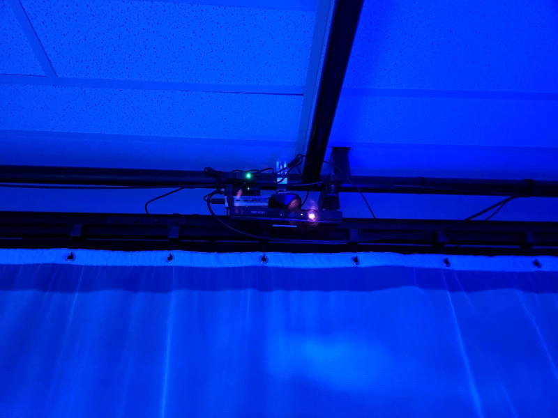

# MYCELIUM - ECHOMARINE
###### Collège Montmorency, exposition temporaire interieure, visité le 23 mars 2023
## Echomarine
###### Florence Lapierre, Natacha Abdallah, Tracy Gua, Maria Laura Coronel, 2023

Echomarine est une expérience immersive qui utilise un dispositif interactif pour nous plonger dans la beauté des fonds marins, tout en mettant en évidence les enjeux environnementaux qui les menacent. Cette expérience interactive permet d'observer des animaux et des plantes marines, avec pour objectif à la fois de susciter la contemplation et de sensibiliser à la protection de l'environnement marin.  
[TIM Montmorency, Mycelium - Echomarine](https://tim-montmorency.com/2023/projets/Echomarine/docs/web/index.html)

### Fonctionnement de l'oeuvre

Echomarine est une installation interactive. Une tablette interactive est mise à disposition des visiteurs pour découvrir et en apprendre plus sur six espèces animales en voie de disparition. En sélectionnant l'un des animaux proposés, les visiteurs peuvent le voir nager d'un mur à l'autre de la pièce, tout en entendant les sons qu'il émet. La tablette offre également des informations détaillées sur l'animal sélectionné, ainsi que sur les menaces qui le mettent en danger, permettant ainsi une prise de conscience accrue de l'importance de la protection de la biodiversité.

### Mise en espace

Les visiteurs de l'exposition ont la possibilité de découvrir des animations projetées sur trois rideaux disposés contre les murs de l'espace. Cette disposition crée une immersion totale dans les œuvres, permettant aux visiteurs de se sentir plongés dans un univers artistique captivant. Les projections sur les rideaux donnent l'illusion d'un espace tridimensionnel, créant ainsi une expérience immersive.

### Composantes et techniques

L'installation interactive offre une expérience immersive unique aux visiteurs de l'exposition, et est conçue de manière complexe pour atteindre cet objectif. Elle se compose de quatre haut-parleurs placés aux coins supérieurs de la pièce, de trois projecteurs qui projettent les animations sur les rideaux, et d'une tablette située au centre sur un podium. Une batterie est attachée derrière le podium pour alimenter la tablette. Pour faciliter l'interaction avec la tablette et avoir une meilleur expérience utilisateur, une Kinect est installée pour détecter la présence humaine et faire disparaître le titre lorsqu'un visiteur entre dans la pièce ainsi que d'activer la lumière en haut du podium. Pour créer une ambiance immersive, les fils sont tous accrochés au plafond de la pièce et facilitent la circulation des visiteurs.

### Éléments nécessaires

L'équipe a utilisé plusieurs logiciels spécialisés pour la création de l'installation. Les animations ont été réalisées avec After Effects, et l'interface web a été conçue avec HTML et CSS. Max/Msp/jitter a été utilisé pour gérer l'interactivité entre la page web, les animations et le détecteur de mouvement. Les logiciels de son utilises étaient Reaper et VCV Rack. Enfin, l'intégration des animations sur les rideaux a été réalisée grâce à l'utilisation de Madmapper. Dans l'ensemble, cette installation artistique offre aux visiteurs une expérience immersive unique.

### Mon expérience

Dès qu'on entre dans la pièce, le titre s'efface et une lumière bleue s'allume au sommet du podium de la tablette. Cette dernière propose six espèces sous-marines parmi lesquelles on peut choisir. En sélectionnant l'une d'entre elles, une description expliquant les raisons de l'extinction de cette espèce est affichée sur la tablette, tandis qu'une animation est projetée sur les trois rideaux. J'ai été complètement plongé dans l'expérience grâce à l'atmosphère créée par les lumières, les sons et les magnifiques animations.

### Mon appréciation

J'ai été particulièrement séduit par l'utilisation de l'espace restreint de la salle pour créer une ambiance immersive, où les visiteurs sont plongés dans l'univers aquatique à travers les magnifiques animations et les sons captivants des animaux marins. De plus, j'ai apprécié la démarche éducative de l'exposition, qui utilise une installation interactive pour sensibiliser les visiteurs à la situation instable des animaux marins en voie d'extinction. C'est une méthode innovante et efficace pour attirer l'attention sur cette problématique.

À mon avis, l'ajout d'autres éléments interactifs pour permettre une interaction plus poussée avec les animaux marins aurait été une excellente idée. Bien que les animations soient impressionnantes, elles ne suffisent pas à maintenir l'attention des visiteurs pendant une période prolongée. Par exemple, des éléments interactifs supplémentaires tels que des jeux ou des quiz pourraient encourager une participation plus active et prolongée de la part des visiteurs.

### Références

[ECHOMARINE](https://tim-montmorency.com/2023/projets/Echomarine/docs/web/index.html)
