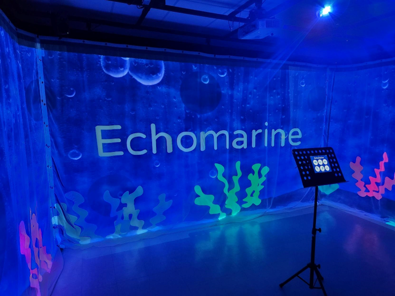
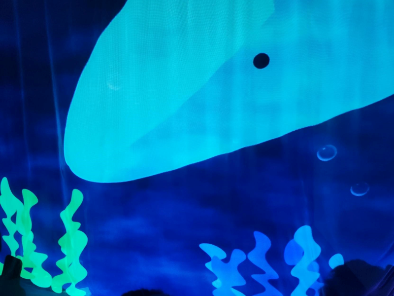
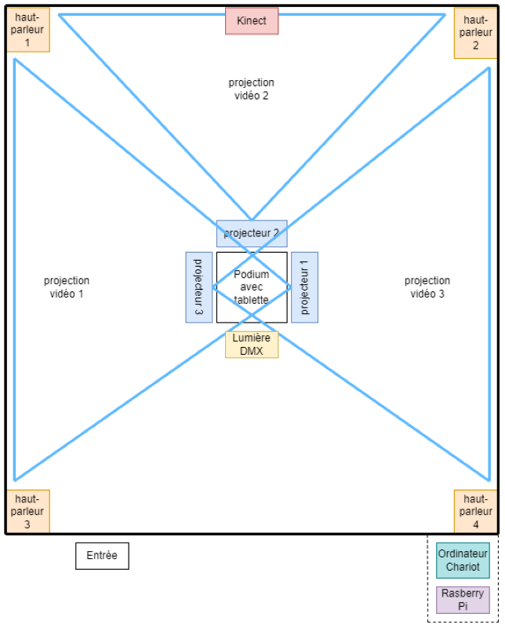

<h1>Exploration des projets en création par les étudiant.e.s de 3e année en TIM</h1>

<h2><a href="https://tim-montmorency.com/2023/projets/LumaSol/docs/web/index.html">1 - Luma sol</a></h2>
<h3>Réalisé par : Éloïse Gagné, Skayla Stimphil, Michaël simard et Pénélope Morrisson</h3>

L'équipe chargée du projet de création a conçu une installation fascinante en installant un moteur sur un vélo stationnaire. Lorsque le moteur est activé, des lumières s'illuminent progressivement accompagnées d'une musique atmosphérique. Cependant, ils ont rencontré quelques problèmes techniques avec le moteur qui ne semblait pas bien s'attacher aux roues du vélo et ne fonctionnait qu'en le tournant manuellement. De plus, le vélo utilisé pour cette installation a été emprunté à l'école, donc ils ont prévu d'en acheter un nouveau pour le projet final.

Parmi toutes les installations qui seront présentées cette année, celle-ci est ma préférée, car elle encourage le spectateur à s'impliquer activement en pédalant pour obtenir un résultat satisfaisant en audio et en visuel. Je trouve que l'idée est très originale et créative. Je trouve aussi que le message que l'équipe souhaite transmettre est vital, car il souligne l'importance pour les humains de rester en contact avec la nature en raison de l'urgence climatique que nous vivons actuellement. Cette installation rappelle que chacun de nous peut avoir un impact positif sur l'environnement en agissant de manière responsable avec la nature.

<h5>https://github.com/Kawabongaaa/LumaSol/tree/main/docs/preproduction#Cartographie-et-Ressources-spatiales-requises-(rangement-et-locaux)</h5>

<h2><a href="https://tim-montmorency.com/2023/projets/EDRIA/docs/web/index.html">2 - Edria</a></h2>
<h3>Réalisé par : Elwin Durand, Loic Delorme, Dominic Roberts, Gabriel Leblanc, Meryem Berbiche et Jean-Christophe</h3>

Lors de la présentation du prototype d'Edria, l'équipe a installé des capteurs de mouvement qui ont créé une expérience interactive captivante, même si l'installation n'était pas encore terminée. Lorsqu'une personne activait une partie de l'expérience, des lumières et des sons se déclenchaient, mais quand plusieurs personnes étaient présentes à différents endroits de l'installation, les lumières et les sons se synchronisaient pour offrir une expérience immersive qui transportait les visiteurs dans un autre monde.

J'ai choisi Edria comme deuxième choix. J'adore le concept de science-fiction sur lequel cette installation est basée et je trouve que c'est une idée très créative. J'aime particulièrement l'idée d'une œuvre collaborative qui nécessite la coopération de plusieurs personnes. L'histoire des explorateurs arrivant dans un monde étranger et découvrant un écosystème fascinant est très captivante, et j'apprécie l'interaction que l'équipe a prévue pour que plusieurs personnes soient nécessaires pour progresser. Cependant, j'ai préféré soutenir le message de Luma Sol, qui souligne l'importance de l'interaction humaine avec la nature dans le contexte de l'urgence climatique actuelle. J'adore les situations qui nécessitent du travail d'équipe, et je pense que tout le monde serait satisfait et heureux de voir le résultat final de l'expérience Edria, grâce au monde fascinant que ce projet vise à présenter.

<h5>https://github.com/F-C-A/EDRIA/tree/main/docs/preproduction</h5>

<h2><a href="https://tim-montmorency.com/2023/projets/Echomarine/docs/web/index.html">3 - Echomarine</a></h2>
<h3>Réalisé par : Florence Lapierre, Natacha Abdallah, Tracy Gua, Maria Laura Coronel</h3>

Echomarine est un projet qui presente des animaux aquatic dans une petite chambre. Grâce à une tablette, on peut selectionner un animal, des renseignements sur l'animal apparait et une animation commence a jouer qui demontre la creature en train de nager sur les murs de la piece ainsi qu'un audio qui accompagne le mouvement de ce meme animal. Au moment de la visite, seulement 2 des 6 animations etaient animées et la tablette n'etait pas independante vu qu'elle affichait l'ecran de l'ordinateur dans la salle.

Ce projet a capter mon attention et mérite sa place en troisième position. Ce qui le rend vraiment different, c'est qu'il se présente dans une petite pièce à l'intérieur. Bien que les interactions avec l'utilisateur soient simples, le résultat est à la fois divertissant et éducatif grâce aux descriptions des animaux marins présentés. Étant passionné par la faune marine et ses traits uniques, je suis sûr que je vais beaucoup apprécier de voir les dessins de ces animaux prendre vie et d'en apprendre davantage sur eux.

<h5>https://github.com/Echomarine/Echomarine/tree/main/docs/preproduction</h5>

<h2><a href="https://tim-montmorency.com/2023/projets/Nexum/docs/web/index.html">4 - Nexum</a></h2>
<h3>Réalisé par : Sébastien Reilly, Sabrina Laforest, Alexandre Daniel, Maxime Des Lauriers</h3>

Lors de la visite, j'ai découvert un projet très intéressant et prometteur, qui consistait en des fils de lumière et de capteur de mouvement. Le fonctionnement était vraiment ingénieux : un capteur de mouvement permettait à chaque fil de lumière de s'activer l'un après l'autre pour créer un cycle de lumière. Le mouvement des ampoules était accompagné par des bruit diffus par des hauts-parleurs. L'équipe avait également créé un code QR pour renvoyer vers la page de leur projet, mais il ne fonctionnait malheureusement pas sur les téléphones Apple. Ils ont prévu de régler ce problème pour rendre l'expérience accessible à tous ainsi que d'allonger les fils de lumière pour créer un parcours encore plus impressionnant.

Ce projet arrive en dernière position car je pense qu'il offre l'expérience la moins intéressante parmi tous les projets présentés cette année. Bien que je sois curieux de découvrir cette œuvre, je ne pense pas que je resterais longtemps à l'observer, car le contenu semble assez court.

<h5>https://github.com/Boucle-RDDL/Nexum/tree/main/docs/preproduction</h5>

<h2>Conclusion</h2>

Pour être en mesure de concevoir des installations interactives, plusieurs cours de techniques d'intégration multimédia sont important. Le premier cours essentiel est la conception d'expériences multimédia. Ce cours permet aux élèves de participer au processus de création en les aidant à développer leur créativité et leur sens de l'organisation. Ils apprennent à concevoir des projets interactifs en analysant les scénarios, en planifiant les besoins en ressources humaines et techniques, et en présentant une conception d'expérience multimédia interactive.

Le cours de traitement audiovisuel est également très important. Il permet à l'élève de concevoir et de réaliser des performances audiovisuelles et des installations interactives. Dans ce cours, les élèves apprennent à utiliser une caméra comme dispositif interactif, à appliquer des effets en temps réel, à manipuler des flux audio et vidéo et à déclencher des vidéos et des échantillons en fonction d'interactions.

Enfin, le cours de conception sonore est crucial pour créer une ambiance sonore parfaite. Toutes les équipes ont utilisé des sons dans leurs projets et il est important d'avoir des compétences en audio pour créer des effets sonores et de la musique adaptés à chaque installation interactive. Ce cours aide les étudiants à comprendre l'importance du son et de la musique dans la conception de projets multimédias interactifs.

Une composante technologique très intéressant qui a été utilisé dans l'installation d'Echomarine est la Kinect. La Kinect est un capteur de mouvement pour les consoles Xbox de Microsoft. Elle utilise une caméra RVB couleur et un capteur de profondeur qui projette des motifs de lumière infrarouge sur l'environnement. Les mouvements de l'utilisateur sont détectés et transformés en commandes pour les jeux vidéo ou les applications. La Kinect crée un modèle en 3D de l'environnement et suit les mouvements de l'utilisateur en temps réel. Elle peut également reconnaître les gestes, expressions faciales et commandes vocales pour une interaction plus naturelle.
