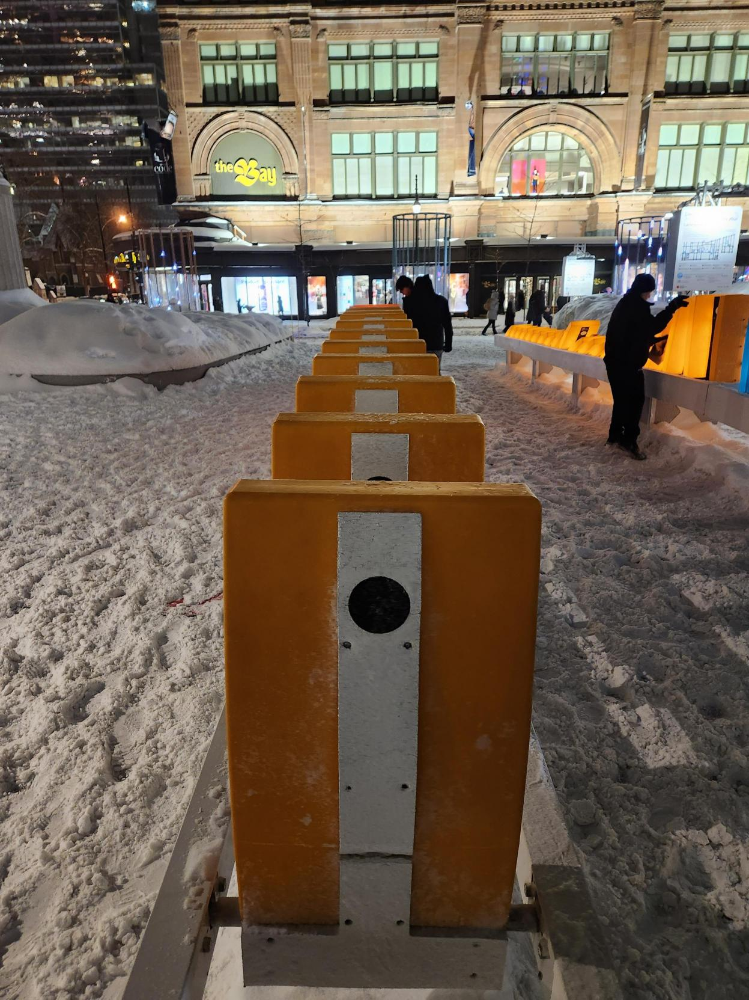

# LUMINOTHERAPIE 13E ÉDITION - EFFET DOMINO
###### Quartier des Spectacles, exposition temporaire exterieure, visité le 4 mars
## Effet Domino
###### Firme: Ingrid Ingrid, 2018

Conception : Ingrid Ingrid
Direction de création : Geneviève Levasseur
Conception interactive : Katherine Melançon
Conception architecture : Enrique Enriquez
Conception sonore : Myriam Bleau
Distribution : Quartier des spectacles international
Producteur délégué à la distribution : Jack World

L'installation interactive "Effet Domino" est constituée de plusieurs enchainements de dominos qui permet aux visiteurs de l'exposition de collaborer pour les faire tomber. Chaque station de domino offre un tracé, des couleurs et des motifs musicaux différents, faisant de chaque station un instrument de musique unique qui fait partie d'un grand orchestre comprenant des voix, des percussions, des marimbas, des balafons et des flûtes.

- 120 dominos réunis en plusieurs modules
- Taille d’un domino : 390mm x 775mm x 80mm
- Poids d’un domino : 7 lbs
- Matériau : en plastique. Ils sont conçus pour être le plus léger possible, en considérant des critères de durabilité, afin que la maniabilité soit optimale. Les dominos ont un pivot qui leur permet de pouvoir tomber et aussi d’être maintenus debout.
- Hauteur : 5 pieds de haut, des pattes jusqu’au haut du domino.

[Effet Domino 9e - Ingrid Ingrid](http://ingrid-ingrid.com/fr_effetdomino)

### Fonctionnement de l'oeuvre

Voici quelques images de la première fois où "Effet Domino" a été exposé :

### Mise en espace

Les visiteurs de l'exposition sont offerts un espace ouvert à l'extérieur où tous les dominos sont assemblés en plusieurs rangées.

### Composantes et techniques

- Haut-parleurs
- Caches-fils
- Dominos en plastique

### Éléments nécessaires

Comme l'exposition se déroule en extérieur, les responsables de luminothérapie n'ont pas effectué d'aménagements particuliers pour Ingrid Ingrid. Les dominos ont déjà été disposés avec les supports en tête, car ils contiennent les haut-parleurs qui produisent les sons pour chaque domino.

### L'expérience attendu

Quand on suit le parcours de Luminotherapie et qu'on arrive à l'Effet Domino, on peut voir deux rangées de dominos qui nous sont offertes. Chaque domino émet son propre bruit lorsqu'il est basculé, permettant ainsi au visiteur de l'exposition de soit faire balancer un domino des deux côtés pour créer des bruits répétés ou faire tomber plusieurs dominos successivement pour produire une petite musique. De belles lumières s'allument à chaque mouvement d'un domino. Cette expérience est là pour nous rappeler nos beaux souvenirs et la satisfaction de faire tomber des dominos les uns à la suite des autres, mais d'une manière qui encourage la coopération grâce à la simplicité et l'accessibilité des dominos.

### Mon experience

Ma propre expérience a été décevante. J'avais imaginé que le projet serait simple, ce qui ne m'aurait pas dérangé, mais il y avait un gros problem. J'ai visité la 13e édition de Luminotherapie l'avant dernier jour de l'exposition, un samedi où il y avait beaucoup de monde pour voir les différentes installations. Cependant, il y avait très peu de monde à l'Effet Domino. L'exposition elle-même ne fonctionnait qu'à moitié. Les lumières et les bruits étaient désynchronisés et se déclenchaient complètement au hasard. Dans la vidéo, vous pouvez voir un exemple de l'exposition où les dominos s'allument tous seuls sans qu'aucun bruit ne soit produit. De plus, les bruits n'étaient pas synchronisés avec les mouvements des dominos ni avec les lumières. L'audio lui-même était vraiment faible, il était presque impossible d'entendre sans être collé aux haut-parleurs.

[Fonctionnement de l'oeuvre](https://youtu.be/7Atbig08fDM)

Le concept de cette installation interactive était vraiment intéressant. J'ai pensé que si je faisais des recherches sur le produit final, je pourrais trouver quelque chose qui m'aurait plu, mais j'ai fini par découvrir que l'Effet Domino de cette année est une nouvelle version qui contient beaucoup moins d'aspects que celle de la 9e édition de Luminotherapie. Par exemple, il y avait un projecteur qui faisait des animations basées sur les mouvements des dominos sur l'UQAM qui a été omis dans la 13e édition, et il y avait seulement 60 dominos au lieu des 120 présents dans la version précédente. De plus, toutes les informations sur la nouvelle version de l'Effet Domino ne sont pas publiées en ligne, le seul article qui pourrait contenir des informations a même été supprimé du site du Quartier des Spectacles, mais le lien vers l'article est toujours présent sur le site.

### Références

[EFFET DOMINO PAR INGRID INGRID](https://www.quartierdesspectacles.com/fr/a-propos/les-productions-du-partenariat/oeuvre/75/effet-domino-par-ingrid-ingrid/#) 
[9E ÉDITION DE LUMINOTHÉRAPIE](https://www.quartierdesspectacles.com/fr/medias/luminotherapie-effet-domino) 
[EFFET DOMINO : DE L’IDÉE À LA CRÉATION](https://www.quartierdesspectacles.com/fr/blogue/771/effet-domino-de-lidee-a-la-creation) 
[LUMINOTHÉRAPIE DÉVOILE LE PARCOURS DE SA 13E ÉDITION](https://www.quartierdesspectacles.com/fr/medias/luminotherapie-devoile-le-parcours-de-sa-13e-edition) 
[EFFET DOMINO - INGRID INGRID](http://ingrid-ingrid.com/fr_effetdomino)
